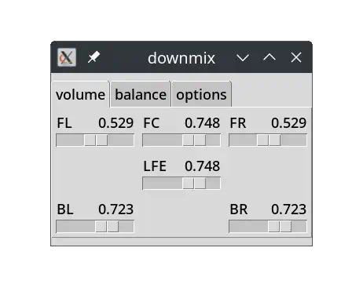

# mpv-downmix-gui

mpv GUI to modify the parameters to downmix surround sound to stereo

a GUI video player that allows to
fine-tune the coefficients of the downmix formula
while the video keeps playing

mpv with interactive control of the audio filter option

```
mpv --af='pan="stereo|..."' video.mp4
```

aka: equalizer for surround audio channels




## normalize

please remember to normalize the volume.
in most movie releases, audio tracks are too quiet

1. downmix to stereo: `ffmpeg -af pan=...`
2. analyze volume: `ffmpeg -af loudnorm=i=-14:lra=7:tp=-2:offset=0:linear=true:print_format=json`
3. downmix to stereo and normalize volume: `ffmpeg -af pan=...,loudnorm=...`

see also

- https://ffmpeg.org/ffmpeg-filters.html#loudnorm
- https://github.com/slhck/ffmpeg-normalize


## related

- [Properly downmix 5.1 to stereo using ffmpeg](https://superuser.com/questions/852400/properly-downmix-5-1-to-stereo-using-ffmpeg)
